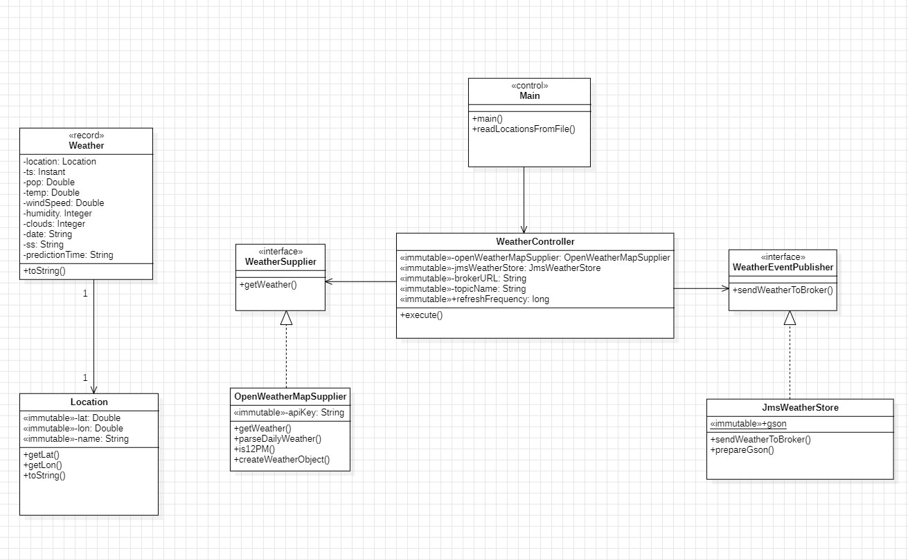
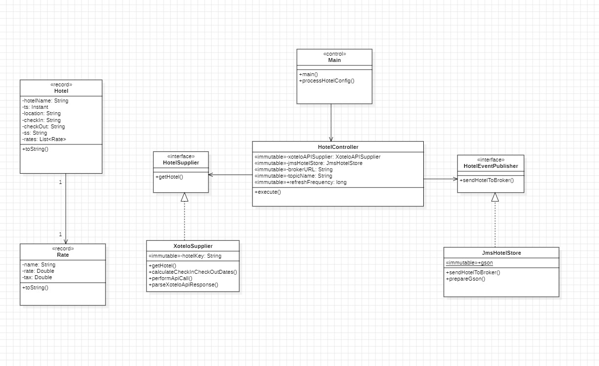
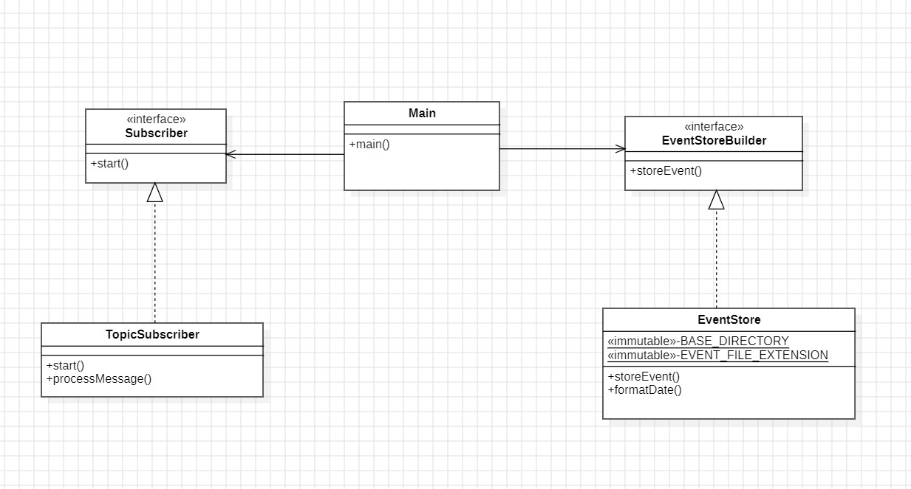
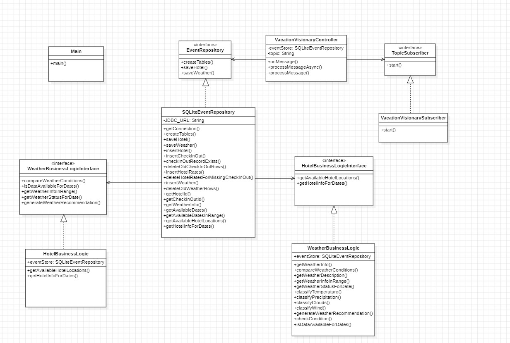
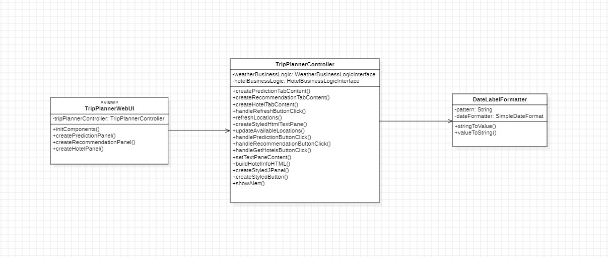

# Vacation Visionary Application

- **Title:** Vacation Visionary Application
- **Subject:** Data science application development
- **Course:** Second
- **Academic Year:** 2023
- **Degree:** Data Science Engineering Data
- **School:** Computer engineering school (EII)
- **University:** Las Palmas de Gran Canaria University (ULPGC)

## Summary of Functionality
This Java project is an application whose objective is to make it easier for the user to make the decision of where they are going to spend their vacation that integrates four modules: Weather Provider, Hotel Provider, Datalake Builder and Vacation Visionary. The Weather Provider and Hotel provider modules obtain the necessary data from the OpenWeatherMap and Xotelo API, process it and send it to a message broker (Apache ActiveMQ). On the other hand, the Datalake Builder permanently subscribes to these events and stores them locally, providing a mechanism to access historical data. Finally, Vacation Visionary is responsible for receiving the messages by subscribing to the topics and stores them in a datamark. Then, this data is taken from the datamark and used in the business logic with which the user can interact through the graphical web interface (Java Swing). The application works periodically and the providers update the data every 6 hours.

## How to run .jar files
1. First open a terminal and start the activemq execution.
2. Second open a terminal for each execution
3. Then do the cd instructions in the folder where the .jar is in each terminal.
4. You can run the Data Lake Builder whenever you want with this command: java -jar (name of the .jar).jar (introduce a basePath).
5. Then start the vacation visionary execution with this command: java -jar (name of the .jar).jar
6. Then start the hotel supplier execution in with this command: java -jar (name of the .jar).jar
7. Finally, start the execution of the weather supplier with this command: java -jar (name of the .jar) (your apiKey).

## Things to keep in mind
1. Ensure you have a valid API key for OpenWeatherMap. Obtain it here.
2. During the first execution the interface will take a while to receive the data, since there is no data in the datamart. During this period, the location dropdown menus will appear empty. Therefore, when you know that the app has received the first events from the hotel (via the terminal), click on the buttons that appear in each tab called "update tab" and the drop-down menus will be filled with the locations. `It is very important not to click on the "Predict conditions", "Get recommendations" and "Get available hotels" buttons without the first hotel events having arrived and click the "Refresh tab" button`.
3. I recommend pressing the "refresh tab" button before querying the interface so that the data is as recent as possible.
4. I recommend putting the interface in full screen for a better experience

## Project Structure
The project's architecture is thoughtfully organized into well-defined packages, each serving a specific purpose:

### Weather Provider Module
The Weather Provider module is responsible for obtaining and updating weather data from the OpenWeatherMap API every six hours. For its execution it is necessary to enter the api key as an argument.
- **Control Package (org.ulpc.dacd.control):**
  - `Main:` Module entry point. Initializes key components and triggers weather data updating. It also reads the locations file located in the module's resoueces folder and an argument that the user must enter: the OpenWeatherMap apikey
  - `OpenWeatherMapSupplier:` Communicates with the OpenWeatherMap API, retrieves, and parses weather data.
  - `JmsWeatherStore:` Connects to the message broker (ActiveMQ) and sends weather data.
  - `WeatherController:` Orchestrates the execution of tasks at regular intervals, ensuring the periodic update of weather data.
  - `WeatherEventPublisher:` Defines an interface for sending weather data to the message broker.
  - `WeatherSupplier:` Interface for fetching weather data based on location and timestamp.

- **Model Package (org.ulpc.dacd.model):**
  - `Weather:` Represents weather data, including information such as precipitation probability, wind speed, temperature, humidity, and more.
  - `Location:` Represents a geographical location with latitude, longitude, and a name.
- **locations.txt structure:**
- This is a .txt file where the locations are saved. Its format is the following: lat, lon,name
- Example: 40.41581172250397, -3.6927121960696088,Madrid

### Hotel Provider Module
The Hotel Rate Provider module is responsible for retrieving and updating hotel rate data from the Xotelo API. The module uses a timer-based mechanism to periodically retrieve hotel rates and post them to an ActiveMQ broker every six hours.
- **Control Package (org.ulpc.dacd.control):**
  - `Main:` Module entry point. Initializes key components and triggers weather data updating. Additionally, the hotels.txt file is read
  - `XoteloSupplier:`  Communicates with the Xotelo API, retrieves, and parses hotel rate data based on provided parameters such as hotel name, check-in and check-out dates, and location.
  - `JmsHotelStore:` Connects to the ActiveMQ message broker and sends hotel rate data in JSON format.
  - `HotelController:`  Orchestrates the execution of tasks at regular intervals, ensuring the periodic update of hotel rate data. Utilizes a TimerTask for scheduling.
  - `HotelEventPublisher:` Interface defining the contract for classes responsible for sending hotel data to the message broker.
  - `HotelSupplier:` Interface defining the contract for classes responsible for fetching hotel data.

- **Model Package (org.ulpc.dacd.model):**
  - `Hotel:` Represents hotel data, including information such as hotel name, location, timestamp, a list of rates...
  - `Rate:` Represents rate information for a hotel, including provider name, rate, and tax.
- **hotels.txt structure:**
- This is a .txt file where hotel information is saved. Its format is as follows: hotelName, location, hotelKey
- Example:Mandarin Oriental Ritz, Madrid, g187514-d190570

### Datalake Builder Module
The datalake builder module is responsible for subscribing to messages from two ActiveMQ topics, "hotel.rates" and "prediction.weather", and for storing the received events in a structured directory hierarchy. The module acts as a subscriber, processing messages and preserving them in files organized by timestamp, ss, and topic. Additionally, the user must enter the root directory as an argument.
- **Control Package (org.ulpgc.dacd.control):**
  - `Main:` Module entry point. Validates the command line argument and initializes  key components.
  - `EventStore:` Responsible for storing weather and hotel events locally.
  - `TopicSubscriber:` Subscribes durable to weather forecast messages from the topic `prediction.weather` and hotel messages from the topic `hotel.rates` and stores the events using `EventStore`.
  - `Subscriber:` Interface defining the contract for classes that subscribe to messages.
  - `EventStoreBuilder:` Interface defining the contract for classes that store weather and hotel events.
 
### Vacation Visionary Module
The Vacation Visionary app allows users to plan their trips taking into account both weather conditions and hotel availability in a specific location. The main functionality is divided into three areas: weather forecasts, travel recommendations and available hotels.
  -`Weather forecast:` Users can get weather predictions for a selected location and date. Detailed information is provided, such as probability of precipitation, wind speed, temperature and humidity.
  -`Travel recommendations:` Users can receive travel recommendations based on expected weather conditions. The app evaluates weather data over a range of dates and provides suggestions for planning activities based on weather conditions.
  -`Available hotels:` Users can browse available hotels in a location for a selected date range.
- **Main (org.ulpc.dacd):**
   - `Main:` Module entry point. Initializes key components.
- **Control Package (org.ulpc.dacd.control):**
  - `VacationVisionarySubscriber:` Subscribes durable to weather forecast messages from the topic `prediction.weather` and hotel messages from the topic `hotel.rates`.
  - `VacationVisionaryController:`  Manages messages based on the topic and controls which method to call to store the data in the datamart.
  - `SQLiteEventRepository:` Perform SQLite operations with events related to the datamark.
  - `WeatherBusinessLogic:`  Handles business logic related to weather data.
  - `HotelBusinessLogic:` Handles business logic related to hotel data.
  - `EventRepository:` Interface that defines the contract for the classes responsible for saving data and creating tables in the datamart.
  - `TopicSubscriber:` Interface defining the contract for classes that subscribe to messages.
  - `WeatherBusinessLogicInterface:` Interface that defines the contract for the classes that handle weather-related business logic.
  - `HotelBusinessLogicInterface:` Interface that defines the contract for the classes that handle hotel-related business logic.
- **View Package (org.ulpgc.dacd.view):**
  - `TripPlannerWebUI:` Represents the main user interface for the Trip Planner application. Contains tabs for weather, travel recommendations, and available hotels.
  - `TripPlannerController:` Connects the UI with the underlying business logic for hotel and weather related functionalities. Creates panels and handles user interactions.
  - `DateLabelFormatter:` Custom formatter for date labels in the UI, ensuring proper date conversion and formatting.
- **module-specific dependencies:**
- `SQLite JDBC Driver (org.xerial:sqlite-jdbc:3.44.1.0):` Provides JDBC connectivity to SQLite databases for managing hotel-related data.
- `JCalendar Library (com.toedter:jcalendar:1.4):` Offers calendar components for easy date selection in the user interface, enhancing the user experience when interacting with date-related functionalities.
- `JDatePicker Library (org.jdatepicker:jdatepicker:1.3.4):` Provides date picker components that integrate with Swing-based applications, facilitating the selection of dates in the user interface.

## Design
The project strictly adheres to fundamental design principles, emphasizing modularity, separation of concerns, and code readability. Each module has its well-defined responsibilities, contributing to a robust and maintainable codebase.

### Design Principles and Patterns
- **Command Pattern:** The event handling in the UI, where actions (button clicks) trigger specific commands (e.g., handlePredictionButtonClick, handleRecommendationButtonClick), reflects a command-like pattern.
- **Observer Pattern:** The TopicSubscriber interface and the start method suggest the implementation of the Observer pattern. Subscribers can register and receive events.
- **Single Responsibility Principle (SRP):** Classes  have a single responsibility, such as the WeatherBusinessLogic and HotelBusinessLogic, which handle weather and hotel-related business logic, respectively.
- **Model-View-Controller (MVC):** The application structures follow MVC, an example is Vacation Visionary. The controller organizes the interactions between the model (business logic) and the view (user interface components).

### Class Diagram
### Weather Provider Module

### Hotel Provider Module

### Datalake Builder Module

### Vacation Visionary Module

### Dependencies

## Resources Used
### Libraries
- **Gson:** A Java library for JSON serialization and deserialization.
- **ActiveMQ:** Apache ActiveMQ for message subscription and handling.
- **Log4j API and Log4j Core:** Facilitates logging functionalities within the application.
- **SLF4J API:**  Serves as a simple logging facade for Java, providing a bridge between different logging frameworks. 

